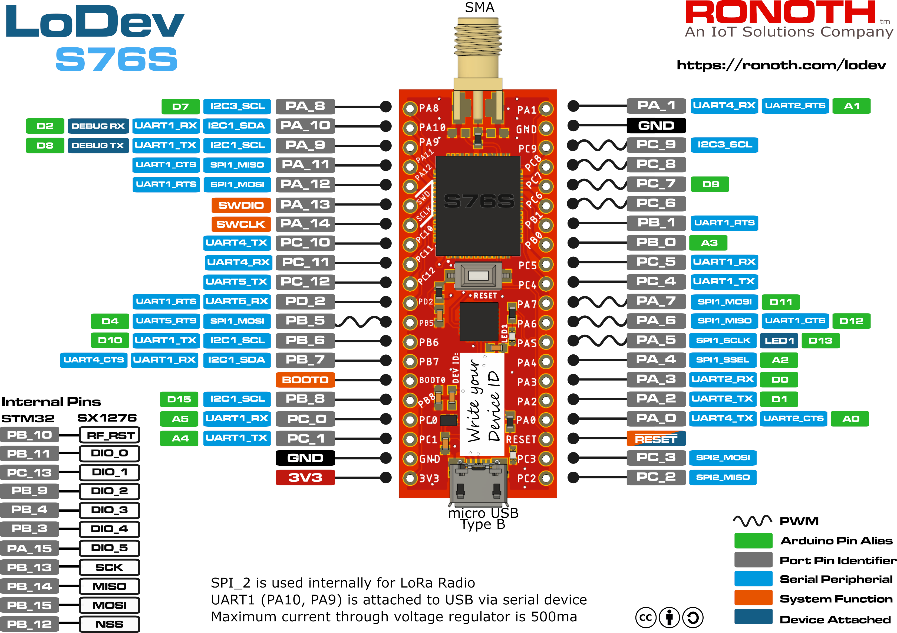

# LoDev
Hardware files and documentation for LoDev

## Specifications

* [S76S SoC documentation](S76S-product-specifications.pdf)
* [STM32L073 datasheet](https://www.st.com/resource/en/datasheet/stm32l073rz.pdf)

## Design Files

Checkout the eagle [.brd](lodev-s76s.brd) and [.sch](lodev-s76s.sch) files in this repository.  A [schematic pdf](lodev-s76s-sch.pdf) is also available.

## Pinout

